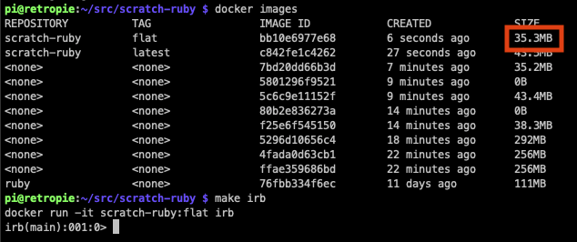

# scratch-ruby

Source Image: ruby:2.6.5-slim-buster

Multistage build for reducing a portable Ruby MRI down to the smallest and most secure possible container.

Current Size: 40.7MB



To Build:

``` sh
make
```

To run IRB:

``` sh
make irb
```

To Build Alpine comparison:

``` sh
make alpine
```
